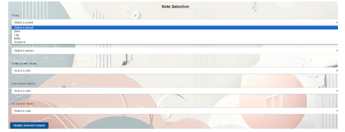
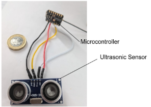
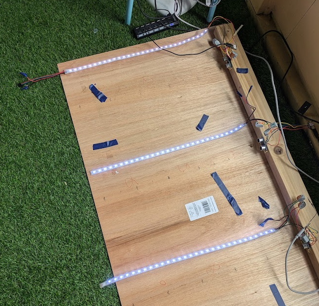

<h1 style="font-family: Arial, sans-serif; color: #4CAF50;">Musical Staircase</h1>
This repository contains the complete codebase for my Musical Staircase project, developed as part of my Master's Dissertation at Queen's University Belfast. The project integrates both frontend and backend components for the web application, along with the separate device-specific code used to interact with IoT hardware.

Project Overview
The Musical Staircase project is an IoT-based interactive system designed to play musical notes as users ascend or descend a staircase. The system combines hardware, software, and web technologies to deliver a fun and engaging experience.

Score: 71% (Distinction Level for this Dissertation Module)
Features

<h2> Frontend: </h2>

Web application built using React for an intuitive user interface.

<h2> Backend: </h2>

Server-side integration written in Python, featuring MQTT communication for real-time device interaction.

<h2> IoT Devices: </h2>

Developed device-specific code using Arduino to interface with sensors and actuators.
Technologies Used
Programming Languages:
Python
JavaScript (React)
Arduino/C
Frameworks & Tools:
React (Frontend)
MQTT (Messaging Protocol)

